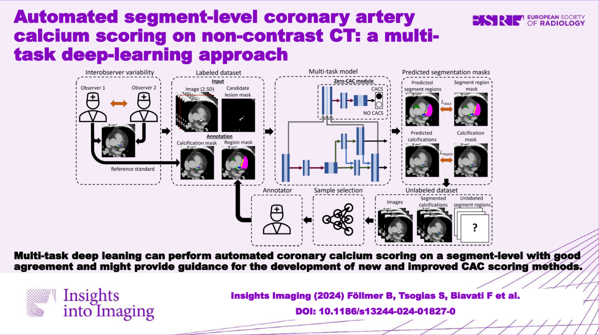

# Automated segment-level coronary artery calcium scoring on non-contrast CT

This repository is the official implementation of [Automated segment-level coronary artery calcium scoring on non-contrast CT: a multi-task deep-learning approach](https://insightsimaging.springeropen.com/articles/10.1186/s13244-024-01827-0).



### Installation using conda
The installation has been tested on Ubuntu 18.04.5 LTS.

```
conda create -n env_segmentcacs python=3.10
conda activate env_segmentcacs
pip install -r requirements.txt
```

## Prediction

To predict the model in the paper, copy  all non-contrast enhanced cardiac CT into the data folder. 
To run the script, you can run the segmentcacs.sh script or run the python script in the terminal directly.

GPU-Version
```
python segment_cacs_predict.py -m <path_to_pretrained_model> -d <path_to_data_folder> -p <path_to_prediction_folder> -f mhd -gpu cuda
```
CPU-Version
```
python segment_cacs_predict.py -m <path_to_pretrained_model> -d <path_to_data_folder> -p <path_to_prediction_folder> -f mhd -gpu cpu
```

Prediction of dicom files: The folder in <path_to_data_folder> should contain dicom series folders (a dicom series is a folder containing all the dicom files (.dcm) of a scan).
```
python segment_cacs_predict.py -m <path_to_pretrained_model> -d <path_to_data_folder> -p <path_to_prediction_folder> -f dcm -gpu cuda
```

## Pre-trained Models

You can find the pretrained model in the model folder.

## Training

Since the training set and corresponding annotations are not public, a training script is not provided. 

## Contributing

Bernhard Föllmer  
Charité - Universitätsmedizin Berlin  
Klinik für Radiologie  
Campus Charité Mitte (CCM) 
